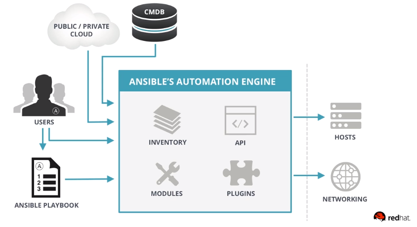

# Ansible 


## Agenda

- What is Ansible
- Why Ansible
- Ansible Use Cases
- Ansible Concept
- Ansible Architecture
- Playbooks

## What is Ansible

- Ansible is OpenSource configuration managment and provisioning tool, similar to Chef, Puppet, Salt, etc.
- Ansible uses SSH (in most common case) to connect your servers and run confugiried Tasks. Ansible let you control and configure multilpe nodes from a single machine.
- What makes Ansible different from other managment software is that Ansible is fully agent-less and use SSH infrastructure.
- Ansible project was founded in 2013 and bought by RedHat in 2015.

[Ansible quckstart guide](https://www.ansible.com/resources/videos/quick-start-video)

## Why Ansible

- **No Agent**. As long as machine can be ssh'd into and able to execute Python code, it can be configuried with Ansible and even more.
- **Idempodent**. Ansible whole achitecture is structured around the concept of idempodency. The core idea is that you only do things if they are needed and that things are repeatable without side effect.
- **Declarative**. Some of other configuration managment tool tend to be procedural do this and then do that and so on. Ansible works by you writing a description of desired state of machine and then Ansible takes steps to fulfill that description.
- **Thiny Learning Curve**. Ansible is quite easy to learn. It doesn't requrie any extra knowladge.

## Ansible Use Cases

- Provisioning
- Configuration Managment
- App deployment
- Continius delivery
- Orchestration
- Other

## Ansible concept

These concepts are common to all uses of Ansible.

- Control node
- Managed nodes
- Inventory
- Modules
- Tasks
- Playbooks

### Control Node

Any machine with Ansible installed.

### Managed nodes

The network devices (and/or servers) you manage with Ansible. Managed nodes are also sometimes called “hosts”. Ansible is not installed on managed nodes. In general case managed nodes needs to be accessiable by ssh from control node and need to have Python installed.

### Inventory

A list of managed nodes. An inventory file is also sometimes called a “hostfile”. Your inventory can specify information like IP address for each managed node. An inventory can also organize managed nodes, creating and nesting groups for easier scaling.

The inventory file can be in many format such as YAML, INI, etc.

Example of inventory file 


```
[web]
web01.example.com
web02.example.com
web03.example.com

[loadbalancer]
lb01.example.com
lb02.example.com

[db]
psql[01:03].example.com

[external:children]
web
loadbalancer
```

Future reading: [how to build your inventory](https://docs.ansible.com/ansible/latest/user_guide/intro_inventory.html#intro-inventory)

### Modules

The units of code Ansible executes. Each module has a particular use, from administering users on a specific type of database to managing VLAN interfaces on a specific type of network device. You can invoke a single module with a task, or invoke several different modules in a playbook. For an idea of how many modules Ansible includes, take a look at the [list of all modules](https://docs.ansible.com/ansible/latest/modules/modules_by_category.html#modules-by-category).

Each module is mostly standalone and can be written in standart scription lagnadge (such as Python, Perl, Ruby or Bash, most of modules written in Python). One of the giuding properties of modules is idempotency, whith means that even if an operation is repeated multiple times it will always place the system into the same state.

For example, task

```
    - name: Ensure Nginx is running
      systemd: name=nginx started=yes
```

will ensure that systemd service nginx is started, that means that service will start if it stopped and do nothing if it started already and several execution of this task will keep system in same desired state.

In addition to official modules you may use a various of comunity supported or write your own.

### Tasks

The units of action in Ansible. You can execute a single task once with an ad-hoc command.

### Playbooks

Ordered lists of tasks, saved so you can run those tasks in that order repeatedly. Playbooks can include variables as well as tasks. Playbooks are written in YAML and are easy to read, write, share and understand. 

Furure reading: [Intro to Playbooks](https://docs.ansible.com/ansible/latest/user_guide/playbooks_intro.html#about-playbooks)

## Ansible architecture and recap



## Playbooks

Playbook are simple YAML files. These file are descriptions of the desired state of your systems. Ansible then does the hard work of getting your systems to that state no matter that whet state they are currently in. 

Playbook are simple to write and maintain as it written in a simple (close to natural) language and self-explanatory in most cases. 

**Playbook** contain **Plays**.

**Plays** contain **Tasks**

**Tasks** call **Modules**

### Exammple of simple ansible playbook

```
---
- hosts: web
  remote_user: root
  tasks:
    - name: Ensure Nginx is a latest version
      yum:
        name: httpd
        state: latest

    - name: Ensure Nginx is running
      systemd:
        name: nginx
        started: yes
        enabled: yes
```

Same playbook in other form:

```
---
- hosts: web
  remote_user: root
  tasks:
    - name: Ensure Nginx is a latest version
      yum: name=httpd state=latest

    - name: Ensure Nginx is running
      systemd: name=nginx started=yes enabled=yes
```

Example playbook with multiple plays:

```
---
- hosts: web
  remote_user: root

  tasks:
  - name: ensure apache is at the latest version
    yum:
      name: httpd
      state: latest
  - name: write the apache config file
    template:
      src: /srv/httpd.j2
      dest: /etc/httpd.conf

- hosts: db
  remote_user: root

  tasks:
  - name: ensure postgresql is at the latest version
    yum:
      name: postgresql
      state: latest
  - name: ensure that postgresql is started
    service:
      name: postgresql
      state: started
```
